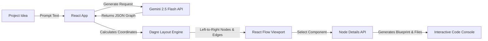

# ⚡ BuildFlow — AI-Powered Software Architecture Designer

<div align="center">

[](https://vite.dev/)
[](https://react.dev/)
[](https://reactflow.dev/)
[](https://deepmind.google/technologies/gemini/)
[](LICENSE)

**An AI-driven software architecture visualizer and boilerplate generator built for builders, startups, and engineers.**

[Key Features](#-key-features) • [System Architecture](#-system-architecture) • [Directory Structure](#-directory-structure) • [Getting Started](#-getting-started) • [Contributors](#-contributors)

</div>

---

## 📖 Introduction

Designing software architecture is hard. Mapping components, arranging layouts, and setting up initial project files manually wastes hours of developer time. 

**BuildFlow** bridges this gap. A user types an application idea (e.g., *"Expense Tracker with Stripe payments"*) and BuildFlow uses **Gemini 2.5 Flash** to compile a complete software architecture diagram. The diagram is laid out horizontally, includes structural folder definitions, and provides boilerplate code files that are ready to download and run.

---

## 🚀 Key Features

### 🎨 Catchy Neon Dark Mode
* An elite, typography-first landing experience utilizing Plus Jakarta Sans and Inter fonts.
* A shimmering color gradient headline (Pink → Purple → Cyan → Green) with soft text drop shadows.
* A canvas-based **Symmetric Geometric Mesh** that rotates and connects particles across **8-fold radial axes** behind the landing elements.

### 🌀 Glassmorphic Progressive Reactor Loader
* Replaces basic spinner icons with a dual-ring concentric **"Reactor" Core** that spins in opposite directions using custom keyframes.
* A shifting colorful aura shadow glows behind the glass panel card.
* Displays a live **monospaced compiler console** showing real-time debugging status codes matching active generation steps (e.g. `DAGRE: Computing force-directed node positions...`).

### 🗺️ Left-to-Right Graph Canvas
* Arranges system layers (Client → Gateway → Services → Infrastructure) from left to right using the Dagre layout engine.
* Clicking any node dims unselected components to `0.3` opacity and highlights connected edges.
* Displays a custom MiniMap with transparent viewport highlights and borderless gray block nodes.
* Hides the standard React Flow watermarks for a cleaner UI.

### 💻 Code Viewer & Directory Tree
* Renders recursive folder trees with collapse/expand folders.
* Displays multiple boilerplate code files in active file tabs with line numbers, code syntax highlight boxes, and quick-copy buttons.

### 🛡️ Silent API Resilience
* Uses a custom retry wrapper with exponential backoff (`1.5s`, `3.0s`, `6.0s`, `12.0s`) to catch rate limits (HTTP 429), token thresholds, and transient network errors.
* Auto-retries run silently without showing error prompts to the user.

---

## 🔮 System Architecture



---

## 📂 Directory Structure

```text
BuildFlow/
├── public/                 # Static assets (Favicons, custom SVG vector maps)
├── src/
│   ├── assets/             # Images and styling assets
│   ├── components/
│   │   ├── About/          # Dedicated About page features and styles
│   │   ├── CodeViewer/     # Code editor console with active file tabs
│   │   ├── ComponentInspector/ # Sliding details panel and recursive folder tree
│   │   ├── CustomEdge/     # Custom canvas connections with moving dash lines
│   │   ├── CustomNode/     # React Flow node cards (categorized by tech stack)
│   │   ├── EdgeDetails/    # Sliding connection metadata panel
│   │   ├── FlowCanvas/     # 2D graph engine viewport with control bars
│   │   ├── Header/         # Landing header, logo, and Symmetric background canvas
│   │   ├── IdeaInput/      # Describe card prompt container and template chips
│   │   └── WorkspaceHeader/ # Header panel for prompt editing and Vercel actions
│   ├── data/               # Sample data configurations
│   ├── services/
│   │   ├── architectureService.js  # Main graph generation service with retry wrapper
│   │   ├── implementationService.js# Boilerplate code file generation service
│   │   └── nodeDetailsService.js    # Component metadata generation service
│   ├── styles/             # Global utility styles
│   ├── Utils/
│   │   ├── cache.js        # Graph nodes metadata caching to prevent redundant API queries
│   │   ├── graphLayout.js  # Dagre layout manager (Left-to-Right)
│   │   └── retry.js        # Reusable API rate limit retry wrapper
│   ├── App.css             # Main styling rules (React Flow overrides, progressive loaders)
│   ├── App.jsx             # Core view router and state manager
│   ├── index.css           # Design tokens (colors, variables, scrollbars)
│   └── main.jsx            # React root injection script
├── package.json            # Dependencies configuration (React Flow v11, Vite, Gemini AI)
└── vite.config.js          # Vite build settings
```

---

## 🛠️ Getting Started

### 1. Clone the Repository
```bash
git clone https://github.com/Aditya2608-byte/BuildFlow.git
cd BuildFlow
```

### 2. Install Dependencies
```bash
npm install
```

### 3. Configure API Keys
Create a `.env` file in the project root:
```env
VITE_GEMINI_API_KEY=your_gemini_api_key_here
```

### 4. Run Locally
```bash
npm run dev
```
Open `http://localhost:5173` inside your browser to start.

### 5. Compile Build
```bash
npm run build
```

---

## 👥 Contributors

<table align="center">
  <tr>
    <td align="center">
      <a href="https://github.com/Aditya2608-byte">
        <br />
        <sub><b>Aditya</b></sub>
      </a><br />
      👑 Project Owner & Lead Developer
    </td>
    <td align="center">
      <a href="https://github.com/X-ImLucky-X">
        <br />
        <sub><b>Lakshya</b></sub>
      </a><br />
      🚀 Core Contributor
    </td>
  </tr>
</table>

---

## 📄 License

This project is licensed under the MIT License - see the [LICENSE](LICENSE) file for details.
